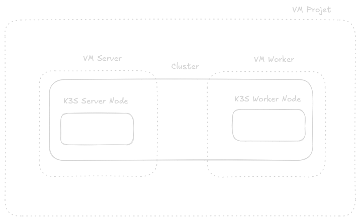
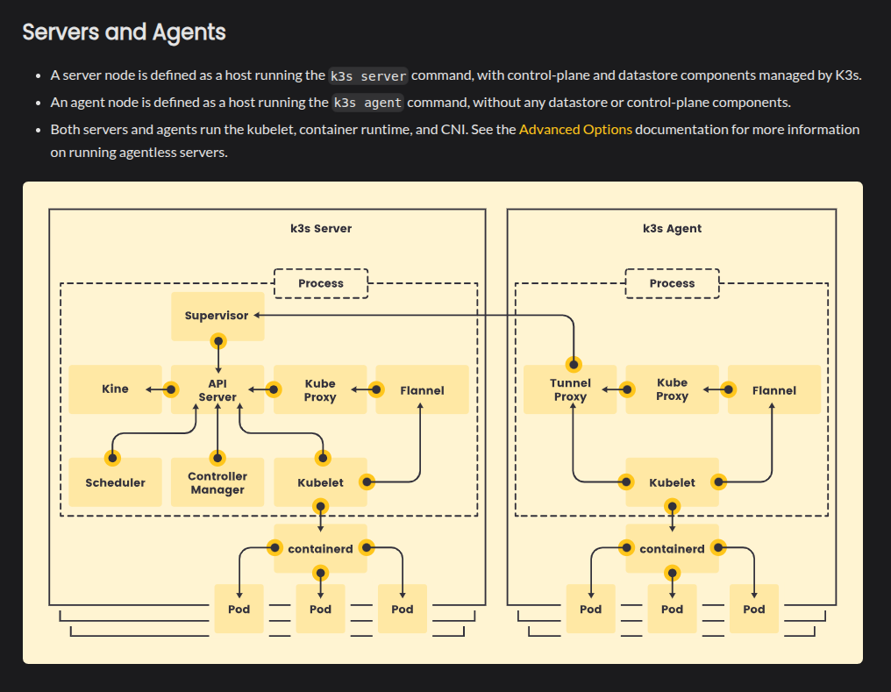

# K3S avec Vagrant

Le but du premier exercice est de lancer **deux VMs** :  

- Dans la **VM server**, on installe Kubernetes et on y place le **master node / control plane**.  
- Dans la **VM worker**, on installe Kubernetes et on y place un **worker node** qui sera rattaché au master node de la VM server.

---

## Le workflow

1. Le **Vagrantfile** configure et provisionne les VMs.  
2. Il appelle les scripts responsables des deux setups Kubernetes.

---

## Les principales commandes Vagrant

(A lancer au niveau du Vagrantfile) :

```bash
vagrant --help          # Affiche l'aide de Vagrant
vagrant up              # Lance et provisionne les VMs définies dans le Vagrantfile
vagrant ssh 'name'      # Se connecter à la VM spécifiée
vagrant provision       # Re-provisionne la VM après modification d'un script
vagrant status          # Affiche l'état des VMs du projet (running, shutoff...)
vagrant halt            # Éteint proprement les VMs (sans les supprimer)
vagrant destroy -f      # Supprime complètement les VMs
virsh list --all        # Liste toutes les VMs libvirt (état bas niveau)
```

---

## Explications des scripts

<details>
<summary><u>server.sh</u></summary>
<br>
Dans la VM **server**, on exécute le script `server.sh` :

- `curl -sfL https://get.k3s.io | sh -`  
- On installe **Kubernetes (k3s)**, qui est une version légère de Kubernetes.  
- On démarre le service **k3s**.

Lors du démarrage de k3s, un **node token** est généré. Il est stocké dans : /var/lib/rancher/k3s/server/node-token


Le script fait ensuite :  
- Attend dans une boucle `while` que le token soit généré.  
- Copie le token dans `/vagrant/token` (dossier partagé Vagrant, monté automatiquement entre la VM et la machine hôte).  
- Rend `/vagrant/token` lisible par tous et donne les droits d’écriture à root.

**Rôle du token :**  
Le token permet à un **worker node** de rejoindre le cluster.  
Le but est donc de rendre le token accessible pour permettre au worker node de se connecter au master node.

</details>

<details>
<summary><u>worker.sh</u></summary>
<br>
Dans la VM **worker**, on exécute le script `worker.sh` :

- On attend que le **token** généré depuis la VM server par le master node soit copié dans le dossier Vagrant accessible par tous.  
- On exécute :  
```bash
curl -sfL https://get.k3s.io | K3S_URL=https://${SERVER_IP}:6443 K3S_TOKEN=${TOKEN} sh -
```
- On installe Kubernetes (k3s).
- On démarre k3s en lui passant l'IP de la VM server et le token du master node.

Ainsi, le worker node dans la VM worker est bien connecté au master node dans la VM server.

</details>

<details>
<summary><u>Dossier partagé /vagrant et NFS</u></summary>
<br>

Le token K3s doit être **écrit** par le server et **lu** par l'agent. Pour cela, les deux VMs doivent accéder à un même dossier partagé : `/vagrant`.

**Avec VirtualBox**, le dossier `/vagrant` est monté automatiquement via les Guest Additions (vboxsf). Rien à configurer, ça fonctionne dans les deux sens (lecture/écriture).

**Avec libvirt/KVM**, il n'y a **pas de Guest Additions**. Le dossier `/vagrant` n'est pas monté par défaut. Il faut le déclarer explicitement dans le Vagrantfile :

```ruby
node.vm.synced_folder ".", "/vagrant", type: "nfs", nfs_udp: false
```

**Pourquoi NFS et pas rsync ?**

| Type | Direction | Usage |
|------|-----------|-------|
| **rsync** | Hôte → VM (copie à `vagrant up`) | Fichiers en lecture seule dans la VM |
| **nfs** | **Bidirectionnel** (hôte ↔ VM, en temps réel) | Fichiers écrits/lus par les deux VMs |

On a besoin de NFS car :
1. `server.sh` **écrit** le token dans `/vagrant/token`
2. `agent.sh` **lit** ce même token depuis `/vagrant/token`
3. Les deux VMs doivent voir le même fichier via le dossier partagé de l'hôte

Avec rsync, un fichier créé dans la VM resterait local à cette VM et ne serait jamais visible par l'autre.

**Prérequis** : un serveur NFS sur l'hôte :
```bash
sudo apt-get install -y nfs-kernel-server
```

</details>

<details>
<summary><u>Adaptations pour libvirt/KVM (--node-ip, race condition)</u></summary>
<br>

Avec **VirtualBox**, chaque VM n'a qu'une interface réseau principale et k3s la prend par défaut. Avec **libvirt/KVM**, chaque VM a **deux interfaces** :

- **eth0** : réseau NAT libvirt (`192.168.121.x`) — gestion SSH, accès internet
- **eth1** : réseau privé Vagrant (`192.168.56.x`) — communication inter-VMs

Par défaut, k3s utilise **eth0** (la première interface). Problème : le server s'annonce sur `192.168.121.x` et l'agent essaie de le joindre sur `192.168.56.110` → ça ne matche pas.

**Flags ajoutés dans server.sh :**

```bash
curl -sfL https://get.k3s.io | INSTALL_K3S_EXEC="\
  --node-ip 192.168.56.110 \
  --advertise-address 192.168.56.110 \
  --tls-san 192.168.56.110" sh -
```

| Flag | Rôle |
|------|------|
| `--node-ip` | Force k3s à s'enregistrer avec cette IP dans `kubectl get nodes` |
| `--advertise-address` | L'API server écoute et s'annonce sur cette IP (pas sur l'IP NAT) |
| `--tls-san` | Ajoute cette IP comme nom valide dans le certificat TLS du server |

**Flag ajouté dans agent.sh :**

```bash
INSTALL_K3S_EXEC="--node-ip 192.168.56.111"
```

L'agent s'annonce aussi avec la bonne IP dans le cluster.

---

**Race condition avec libvirt :**

Avec libvirt, les deux VMs démarrent **en parallèle** (contrairement à VirtualBox qui est séquentiel). Cela pose deux problèmes :

1. **Token périmé** : le dossier `/vagrant` (NFS) peut contenir un token d'un `vagrant up` précédent. L'agent le trouve immédiatement et tente de rejoindre un cluster qui n'existe plus.
   → **Fix** : `rm -f /vagrant/token` au début de `server.sh`

2. **Server pas encore prêt** : l'agent trouve le token mais le server k3s n'est pas encore démarré sur le port 6443.
   → **Fix** : boucle d'attente dans `agent.sh` avant d'installer :
   ```bash
   while ! curl -sk --connect-timeout 2 "https://${SERVER_IP}:6443" >/dev/null 2>&1; do
     sleep 3
   done
   ```

</details>

---

## Récap





Les pods applicatifs sont censés être gérés dans le worker node

---

## Réseau : interactions hôte / VMs

### Interfaces dans la VM : eth0 et eth1

- **eth0** : interface NAT (créée par défaut par Vagrant/libvirt). Elle sert à l’accès Internet depuis la VM (apt, curl, etc.).
- **eth1** : interface du **réseau privé** (voir ci-dessous). C’est elle qui porte l’IP fixe de la VM (ex. 192.168.56.110 pour le server). Le trafic entre les deux VMs (server ↔ agent) et l’accès à l’API K3s (ex. `https://192.168.56.110:6443`) passent par eth1.

En résumé : Internet via eth0 (NAT), cluster K3s et communication inter-VMs via eth1 (réseau privé).

### `node.vm.network :private_network, ip: machine[:ip]`

Cette option crée un **réseau privé** libvirt entre l’hôte et les VMs. Chaque VM a une IP fixe sur ce réseau (192.168.56.110 pour le server, 192.168.56.111 pour l’agent). Cela permet :

- la communication **server ↔ agent** (jointure du worker au master K3s) ;
- l’accès depuis l’hôte aux services exposés sur ces IP (ex. kubectl vers l’API K3s).

### `node.vm.network "forwarded_port", guest: 22, host: machine[:ssh_port], id: "ssh"`

Le **port forwarding** mappe le port SSH (22) **à l’intérieur** de chaque VM vers un port **sur l’hôte** (8080 pour malangloS, 8081 pour malangloSW). Comme les deux VMs ont chacune un service SSH sur le port 22, sans ports hôte différents on ne pourrait pas cibler une VM précise. Depuis l’hôte : `ssh -p 8080 ...` atteint le server, `ssh -p 8081 ...` atteint l’agent ; `vagrant ssh malangloS` et `vagrant ssh malangloSW` utilisent ce mapping en interne.

### Synthèse

Depuis l’**hôte**, on accède aux VMs en SSH via les ports forwardés (8080, 8081) ou `vagrant ssh`. Les **VMs** communiquent entre elles via le réseau privé (eth1, IP 192.168.56.x). Le token K3s est partagé via le dossier `/vagrant` monté par Vagrant entre l’hôte et chaque VM.

