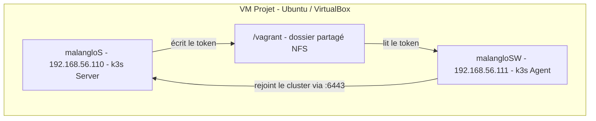

# K3s avec Vagrant

Le but du premier exercice est de lancer **deux VM** avec Vagrant et d'y déployer un cluster k3s :

- La **VM server** (`malangloS`) héberge le **master node** (control plane).
- La **VM agent** (`malangloSW`) héberge un **agent node** qui rejoint le cluster du master.

---

## Workflow

1. Le **Vagrantfile** configure et provisionne les deux VM.
2. Il appelle automatiquement le script correspondant au rôle de chaque VM :
   - `scripts/server.sh` pour la VM server
   - `scripts/agent.sh` pour la VM agent

---

## Architecture

Le schéma ci-dessous résume l'infrastructure de l'exercice. La VM projet (VM mère) contient les deux VM filles qui forment un cluster k3s. Le token de jointure transite par le dossier partagé `/vagrant` (NFS).



<table>
<tr>
<td></td>
<td></td>
</tr>
</table>

Les pods applicatifs sont gérés dans l'agent node. Le server node contient le control plane (API Server, Scheduler, Controller Manager, etc.).

---

## Scripts

<details>
<summary><strong>server.sh</strong></summary>

Ce script est exécuté automatiquement dans la VM **server** lors du provisioning.

Il effectue les opérations suivantes :

1. Il supprime un éventuel token résiduel (`rm -f /vagrant/token`) pour éviter qu'un ancien token ne soit lu par l'agent.
2. Il installe k3s en mode server avec les flags réseau nécessaires :

```bash
curl -sfL https://get.k3s.io | INSTALL_K3S_EXEC="\
  --node-ip 192.168.56.110 \
  --advertise-address 192.168.56.110 \
  --tls-san 192.168.56.110" sh -
```

3. Il attend dans une boucle que le **node token** soit généré par k3s (stocké dans `/var/lib/rancher/k3s/server/node-token`).
4. Il copie ce token dans `/vagrant/token` (dossier partagé NFS) et le rend lisible par tous.

Le token est la clé qui permet à un agent node de rejoindre le cluster. En le plaçant dans `/vagrant`, il devient accessible depuis la VM agent.

</details>

<details>
<summary><strong>agent.sh</strong></summary>

Ce script est exécuté automatiquement dans la VM **agent** lors du provisioning.

Il effectue les opérations suivantes :

1. Il attend que le fichier `/vagrant/token` existe (le server doit l'avoir écrit au préalable).
2. Il attend que l'API server k3s soit accessible sur le port 6443 de la VM server :

```bash
while ! curl -sk --connect-timeout 2 "https://192.168.56.110:6443" >/dev/null 2>&1; do
  sleep 3
done
```

3. Il installe k3s en mode agent en lui passant l'URL du server et le token :

```bash
curl -sfL https://get.k3s.io | K3S_URL=https://192.168.56.110:6443 K3S_TOKEN=${TOKEN} \
  INSTALL_K3S_EXEC="--node-ip 192.168.56.111" sh -
```

L'agent node est alors connecté au master node et apparaît dans `kubectl get nodes`.

</details>

---

## Dossier partagé /vagrant et NFS

### Qu'est-ce que NFS ?

**NFS** (Network File System) est un protocole qui permet de partager des dossiers entre plusieurs machines via le réseau. Une machine exporte un répertoire, et les autres le montent comme s'il était local. Les lectures et écritures sont synchronisées en temps réel.

### Pourquoi un dossier partagé ?

Le token k3s doit être **écrit** par le server et **lu** par l'agent. Les deux VM doivent donc accéder à un même dossier partagé : `/vagrant`.

Avec **VirtualBox**, le dossier `/vagrant` est monté automatiquement via les Guest Additions. Avec **libvirt/KVM**, il n'y a pas de Guest Additions. Il faut le déclarer explicitement dans le Vagrantfile :

```ruby
node.vm.synced_folder ".", "/vagrant", type: "nfs", nfs_udp: false
```

### Pourquoi NFS et pas rsync ?

| Type | Direction | Usage |
|------|-----------|-------|
| **rsync** | Hôte vers VM (copie au `vagrant up`) | Fichiers en lecture seule dans la VM |
| **nfs** | **Bidirectionnel** (hôte et VM, en temps réel) | Fichiers écrits/lus par les deux VM |

NFS est nécessaire car :

1. `server.sh` **écrit** le token dans `/vagrant/token`
2. `agent.sh` **lit** ce même token depuis `/vagrant/token`
3. Les deux VM doivent voir le même fichier via le dossier partagé de l'hôte

Avec rsync, un fichier créé dans une VM resterait local à cette VM et ne serait jamais visible par l'autre.

**Prérequis** : un serveur NFS sur l'hôte :

```bash
sudo apt-get install -y nfs-kernel-server
```

---

## Adaptations pour libvirt/KVM

### Problème des interfaces réseau

Avec **libvirt/KVM**, chaque VM possède **deux interfaces réseau** :

- **eth0** : réseau NAT libvirt (`192.168.121.x`) — gestion SSH, accès internet
- **eth1** : réseau privé Vagrant (`192.168.56.x`) — communication inter-VM

Par défaut, k3s utilise **eth0** (la première interface). Le server s'annonce alors sur `192.168.121.x` alors que l'agent essaie de le joindre sur `192.168.56.110`. Cela ne fonctionne pas.

Les flags suivants forcent k3s à utiliser la bonne interface :

**Dans server.sh :**

| Flag | Rôle |
|------|------|
| `--node-ip` | Force k3s à s'enregistrer avec cette IP dans `kubectl get nodes` |
| `--advertise-address` | L'API server écoute et s'annonce sur cette IP (pas sur l'IP NAT) |
| `--tls-san` | Ajoute cette IP comme nom valide dans le certificat TLS du server |

**Dans agent.sh :**

Le flag `--node-ip 192.168.56.111` permet à l'agent de s'annoncer avec la bonne IP dans le cluster.

### Race condition avec libvirt

Avec libvirt, les deux VM démarrent **en parallèle** (contrairement à VirtualBox qui est séquentiel). Cela pose deux problèmes :

1. **Token périmé** : le dossier `/vagrant` (NFS) peut contenir un token d'un `vagrant up` précédent. L'agent le trouve immédiatement et tente de rejoindre un cluster qui n'existe plus.
   - **Solution** : `rm -f /vagrant/token` au début de `server.sh`

2. **Server pas encore prêt** : l'agent trouve le token mais le server k3s n'est pas encore démarré sur le port 6443.
   - **Solution** : boucle d'attente dans `agent.sh` qui teste la connexion au port 6443 avant de lancer l'installation.

---

## Réseau : interactions hôte / VM

### Interfaces dans la VM : eth0 et eth1

- **eth0** : interface NAT (créée par défaut par Vagrant/libvirt). Elle sert à l'accès internet depuis la VM (apt, curl, etc.).
- **eth1** : interface du **réseau privé**. C'est elle qui porte l'IP fixe de la VM (ex. `192.168.56.110` pour le server). Le trafic entre les deux VM (server et agent) et l'accès à l'API k3s passent par eth1.

En résumé : internet via eth0 (NAT), cluster k3s et communication inter-VM via eth1 (réseau privé).

### Réseau privé

```ruby
node.vm.network :private_network, ip: machine[:ip]
```

Cette option crée un **réseau privé** libvirt entre l'hôte et les VM. Chaque VM a une IP fixe sur ce réseau (`192.168.56.110` pour le server, `192.168.56.111` pour l'agent). Cela permet :

- La communication **server / agent** (jointure de l'agent au master k3s)
- L'accès depuis l'hôte aux services exposés sur ces IP (ex. kubectl vers l'API k3s)

### Port forwarding

```ruby
node.vm.network "forwarded_port", guest: 22, host: machine[:ssh_port], id: "ssh"
```

Le **port forwarding** mappe le port SSH (22) de chaque VM vers un port sur l'hôte (8080 pour malangloS, 8081 pour malangloSW). Comme les deux VM ont chacune un service SSH sur le port 22, des ports hôte différents permettent de cibler chaque VM individuellement.

Depuis l'hôte : `ssh -p 8080 ...` atteint le server, `ssh -p 8081 ...` atteint l'agent. Les commandes `vagrant ssh malangloS` et `vagrant ssh malangloSW` utilisent ce mapping en interne.

### Synthèse

Depuis l'**hôte**, on accède aux VM en SSH via les ports forwardés (8080, 8081) ou via `vagrant ssh`. Les **VM** communiquent entre elles via le réseau privé (eth1, IP `192.168.56.x`). Le token k3s est partagé via le dossier `/vagrant` monté par NFS entre l'hôte et chaque VM.

---

## CLI principales

Les commandes ci-dessous sont à lancer depuis le répertoire contenant le Vagrantfile :

```bash
vagrant up                # Lance et provisionne les VM
vagrant ssh malangloS     # Se connecter à la VM server
vagrant ssh malangloSW    # Se connecter à la VM agent
vagrant status            # Affiche l'état des VM (running, shutoff...)
vagrant provision         # Re-provisionne les VM après modification d'un script
vagrant halt              # Éteint proprement les VM (sans les supprimer)
vagrant destroy -f        # Supprime complètement les VM
```

Depuis la VM server, on peut vérifier l'état du cluster :

```bash
kubectl get nodes         # Liste les noeuds du cluster (server + agent)
kubectl get pods -A       # Liste tous les pods sur tous les namespaces
```

Pour lister toutes les VM libvirt (niveau hyperviseur) :

```bash
virsh list --all
```
