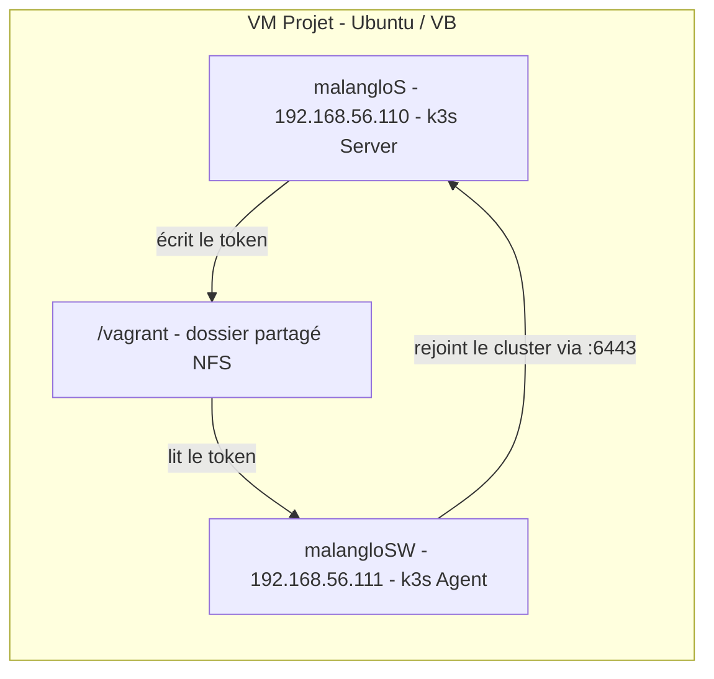
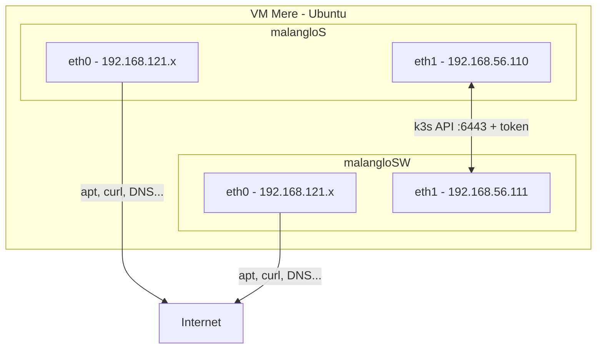
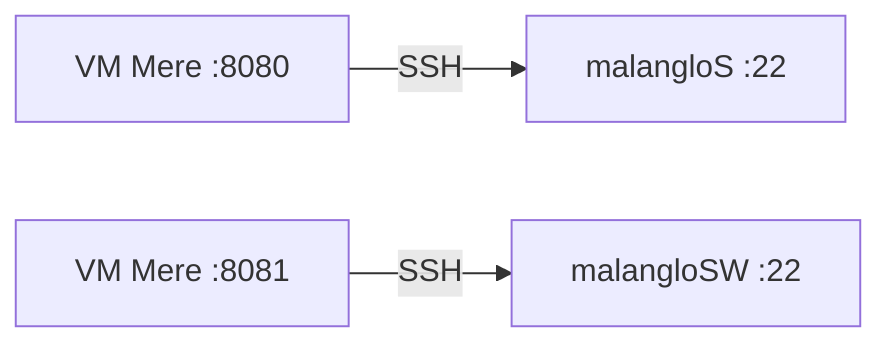

# K3s avec Vagrant

Le but du premier exercice est de lancer **deux VM** avec Vagrant et d'y déployer un cluster k3s :

- La **VM server** (`malangloS`) héberge le **master node** (control plane).
- La **VM agent** (`malangloSW`) héberge un **agent node** qui rejoint le cluster du master.

Le master node gère le cluster (API, scheduling, état) tandis que l'agent node exécute les workloads (pods/containers) qui lui sont assignés.

---

## Workflow

1. Le **Vagrantfile** configure et provisionne les deux VM.
2. Il appelle automatiquement le script correspondant au rôle de chaque VM :
   - `scripts/server.sh` pour la VM server
   - `scripts/agent.sh` pour la VM agent

---

## Architecture

Le schéma ci-dessous résume l'infrastructure de l'exercice. La VM projet (VM mère) contient les deux VM filles qui forment un cluster k3s. Le token de jointure transite par le dossier partagé `/vagrant` (NFS).



<p align="center">
  
</p>


Les pods applicatifs sont gérés dans l'agent node. Le server node contient le control plane (API Server, Scheduler, Controller Manager, etc.).

---

## Scripts

<details>
<summary><strong>server.sh</strong></summary>
<br>

Ce script est exécuté automatiquement dans la VM **server** lors du provisioning.

Il effectue les opérations suivantes :

1. Il supprime un éventuel token résiduel (`rm -f /vagrant/token`) pour éviter qu'un ancien token ne soit lu par l'agent.
2. Il installe k3s en mode server avec les flags réseau nécessaires. La variable d'environnement `INSTALL_K3S_EXEC` est lue par le script d'installation k3s et son contenu est passé comme arguments CLI au binaire k3s au démarrage :

```bash
curl -sfL https://get.k3s.io | INSTALL_K3S_EXEC="\
  --node-ip 192.168.56.110 \
  --advertise-address 192.168.56.110 \
  --tls-san 192.168.56.110" sh -
```

3. Il attend dans une boucle que le **node token** soit généré par k3s (stocké dans `/var/lib/rancher/k3s/server/node-token`).
4. Il copie ce token dans `/vagrant/token` (dossier partagé NFS) et le rend lisible par tous.

Le token est la clé qui permet à un agent node de rejoindre le cluster. En le plaçant dans `/vagrant`, il devient accessible depuis la VM agent.

</details>

<details>
<summary><strong>agent.sh</strong></summary>
<br>

Ce script est exécuté automatiquement dans la VM **agent** lors du provisioning.

Il effectue les opérations suivantes :

1. Il attend que le fichier `/vagrant/token` existe (le server doit l'avoir écrit au préalable).
2. Il attend que l'API server k3s soit accessible sur le port 6443 de la VM server :

```bash
while ! curl -sk --connect-timeout 2 "https://192.168.56.110:6443" >/dev/null 2>&1; do
  sleep 3
done
```

3. Il installe k3s en mode agent en lui passant l'URL du server et le token :

```bash
curl -sfL https://get.k3s.io | K3S_URL=https://192.168.56.110:6443 K3S_TOKEN=${TOKEN} \
  INSTALL_K3S_EXEC="--node-ip 192.168.56.111" sh -
```

L'agent node est alors connecté au master node et apparaît dans `kubectl get nodes`.

</details>

---

## Dossier partagé /vagrant et NFS

Le token k3s doit être **écrit** par le server et **lu** par l'agent. Les deux VM doivent donc accéder à un même dossier partagé : `/vagrant`.

Avec **VirtualBox**, le dossier `/vagrant` est monté automatiquement via les Guest Additions. Avec **libvirt/KVM**, il n'y a pas de Guest Additions. Il faut le déclarer explicitement dans le Vagrantfile :

```ruby
node.vm.synced_folder ".", "/vagrant", type: "nfs", nfs_udp: false
```

L'option `nfs_udp: false` force NFS à utiliser TCP au lieu d'UDP. NFSv4 ne supporte que TCP, ce qui évite des erreurs de montage avec certaines configurations libvirt.

**Prérequis** : un serveur NFS sur l'hôte :

```bash
sudo apt-get install -y nfs-kernel-server
```

<details>
<summary><strong>Qu'est-ce que NFS ?</strong></summary>
<br>

**NFS** (Network File System) est un protocole qui permet de partager des dossiers entre plusieurs machines via le réseau. Une machine exporte un répertoire, et les autres le montent comme s'il était local. Les lectures et écritures sont synchronisées en temps réel.

</details>

<details>
<summary><strong>Pourquoi NFS ?</strong></summary>
<br>

NFS est nécessaire car le partage doit être **bidirectionnel et en temps réel** :

1. `server.sh` **écrit** le token dans `/vagrant/token`
2. `agent.sh` **lit** ce même token depuis `/vagrant/token`
3. Les deux VM doivent voir le même fichier via le dossier partagé de l'hôte

</details>

---

## Réseau

### Les deux interfaces réseau (eth0 / eth1)

Avec **libvirt/KVM**, chaque VM possède deux interfaces réseau, chacune sur un réseau différent :



| Interface | Réseau | IP | Rôle |
|-----------|--------|----|------|
| **eth0** | NAT libvirt (`192.168.121.0/24`) | Dynamique | Accès internet (apt, curl, téléchargement du binaire k3s...) |
| **eth1** | Privé Vagrant (`192.168.56.0/24`) | Fixe | Communication inter-VM, API k3s (:6443), accès depuis l'hôte |

eth0 est créée automatiquement par libvirt. eth1 est créée par la directive suivante dans le Vagrantfile :

```ruby
node.vm.network :private_network, ip: machine[:ip]
```

### Pourquoi forcer k3s sur eth1

Par défaut, k3s s'enregistre sur la **première interface** qu'il trouve, c'est-à-dire eth0. Le server s'annonce alors sur `192.168.121.x` (NAT), mais l'agent essaie de le joindre sur `192.168.56.110` (réseau privé). Cela ne fonctionne pas.

Les flags suivants forcent k3s à utiliser eth1 :

| Flag | Utilisé dans | Rôle |
|------|-------------|------|
| `--node-ip` | server.sh + agent.sh | Force k3s à s'enregistrer avec l'IP du réseau privé dans `kubectl get nodes` |
| `--advertise-address` | server.sh | L'API server écoute et s'annonce sur cette IP (pas sur l'IP NAT) |
| `--tls-san` | server.sh | Ajoute cette IP comme nom valide dans le certificat TLS du server |

### Port forwarding SSH

Chaque VM a SSH sur le port 22. Pour y accéder depuis la VM mère, le port forwarding mappe des ports hôte différents vers chaque VM :



Cela correspond à cette ligne dans le Vagrantfile :

```ruby
node.vm.network "forwarded_port", guest: 22, host: machine[:ssh_port], id: "ssh"
```

Les commandes `vagrant ssh malangloS` et `vagrant ssh malangloSW` utilisent ce mapping en interne.

<details>
<summary><strong>Race condition avec libvirt</strong></summary>
<br>

Avec libvirt, les deux VM démarrent **en parallèle** (contrairement à VirtualBox qui est séquentiel). Cela pose deux problèmes :

1. **Token périmé** : le dossier `/vagrant` (NFS) peut contenir un token d'un `vagrant up` précédent. L'agent le trouve immédiatement et tente de rejoindre un cluster qui n'existe plus.
   - **Solution** : `rm -f /vagrant/token` au début de `server.sh`

2. **Server pas encore prêt** : l'agent trouve le token mais le server k3s n'est pas encore démarré sur le port 6443.
   - **Solution** : boucle d'attente dans `agent.sh` qui teste la connexion au port 6443 avant de lancer l'installation.

</details>

---

## CLI principales

Les commandes ci-dessous sont à lancer depuis le répertoire contenant le Vagrantfile :

```bash
vagrant up                # Lance et provisionne les VM
vagrant ssh malangloS     # Se connecter à la VM server
vagrant ssh malangloSW    # Se connecter à la VM agent
vagrant status            # Affiche l'état des VM (running, shutoff...)
vagrant provision         # Re-provisionne les VM après modification d'un script
vagrant halt              # Éteint proprement les VM (sans les supprimer)
vagrant destroy -f        # Supprime complètement les VM
```

Depuis la VM server, on peut vérifier l'état du cluster :

```bash
kubectl get nodes         # Liste les noeuds du cluster (server + agent)
kubectl get pods -A       # Liste tous les pods sur tous les namespaces
```

Pour lister toutes les VM libvirt (niveau hyperviseur) :

```bash
virsh list --all
```
