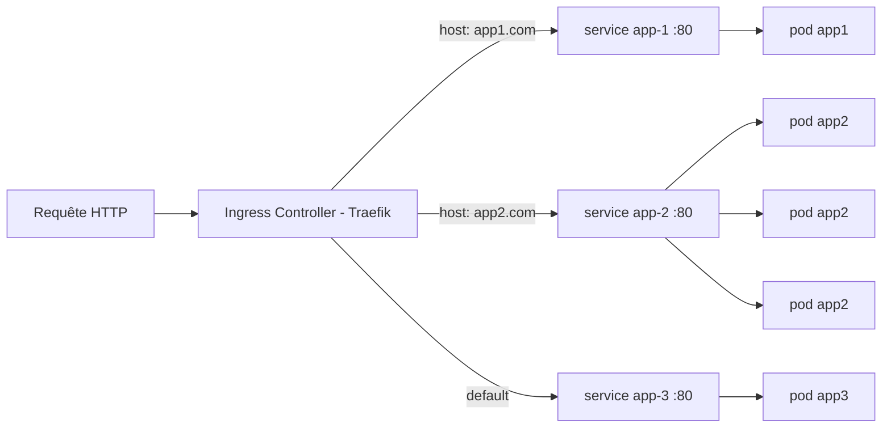
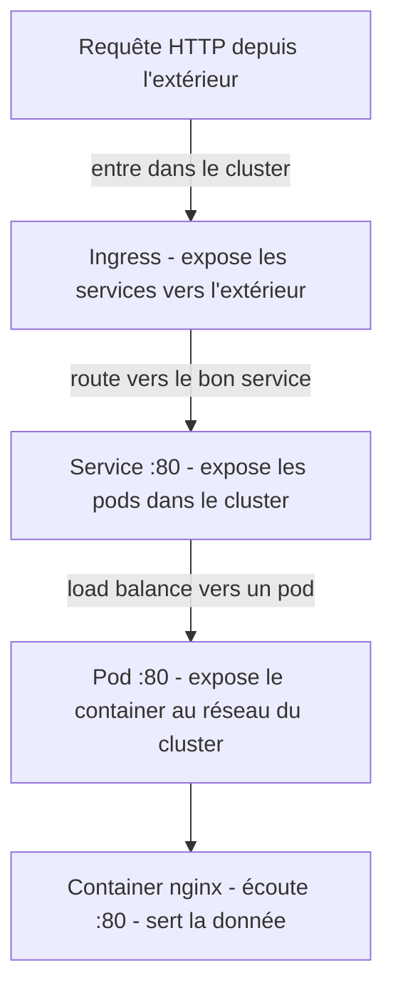

# K3S avec Vagrant Again

Contrairement à l'exo précedent, on ne créer qu'une seule vm. Tout sera donc géré depuis le master node.
Avec K8s ça ne serait pas une bonne pratique mais K3s le permet.

Le but du 2e exo est donc de créer une vm, donc un node dans lequel on lancera 3 apps différentes avec 
- un pod pour app1
- trois pods pour app2
- un pod pour app3

---

## Architecture

<details>
  <summary>Schémas : architecture K3s d'un point de vue général</summary>
  <br>

  <table>
    <tr>
      <td></td>
      <td></td>
    </tr>
  </table>
</details>

<br>

<details>
  <summary>Schémas : architecture infra de l'exo 2</summary>
  <br>

  <table>
    <tr>
      <td></td>
      <td></td>
    </tr>
  </table>
</details>

<br>

<details>
  <summary>Schémas : architecture network de l'exo 2</summary>
  <br>

Flux complet : requête HTTP > Ingress Controller (Traefik) > Service > Pods



  <table>
    <tr>
      <td></td>
    </tr>
  </table>
</details>

<br>

<details>
  <summary>Écouter vs Exposer</summary>
  <br>

Chaque couche **expose** (rend accessible au niveau supérieur) jusqu'au container qui lui **écoute** (reçoit et sert la donnée) :



| Couche | Verbe | Ce qu'elle fait |
|--------|-------|-----------------|
| **Container** | **écoute** | Le processus nginx bind le port 80, reçoit les requêtes et renvoie du HTML |
| **Pod** | **expose** | Rend le port du container accessible au réseau interne du cluster |
| **Service** | **expose** | Fournit une IP stable + DNS + load balancing vers les pods |
| **Ingress** | **expose** | Rend le service accessible depuis l'extérieur du cluster via HTTP |

</details>

---

## Explication du code


<details>
<summary><strong>Vagrantfile</strong></summary>
<br>

<u><strong>Dossier partagé</strong></u>

`sync_folder` monte un volume partagé entre la machine locale et la VM.  
Cela permet de synchroniser des fichiers entre l’hôte et la machine virtuelle sans copie manuelle.

Concrètement :
- les fichiers sont accessibles **des deux côtés**
- toute modification sur le poste local est immédiatement visible dans la VM

---

<u><strong>Réseau</strong></u>

```ruby
server.vm.network :private_network, ip: "192.168.56.110"
```

- Attribue une IP fixe à la VM
- La VM est placée dans un réseau privé
- Accessible uniquement depuis :
    - la machine hôte
    - les autres VM du même hôte
- Non accessible directement depuis l’extérieur

<u><strong>Forwarded port</strong></u>

```ruby
server.vm.network "forwarded_port", guest: 22, host: "8082", id: "ssh"
```

- Redirige le port 8082 de la machine hôte vers le port 22 de la VM
- Permet de se connecter en SSH à la VM via :
  ```ruby
  ssh -p 8082 vagrant@localhost
  ```
  Ce port n’est accessible que depuis la machine locale

💡 En résumé :

- private_network → communication directe hôte ↔ VM via IP
- forwarded_port → accès à un service de la VM via localhost:PORT
</details>

<details>
<summary><strong>Server.sh</strong></summary>
<br>
  Lorsque la VM démarre, le script **server.sh** est automatiquement exécuté.

- Installation de k3s avec :
```ruby
curl -sfL https://get.k3s.io | sh -
```

- on créer le dossier /root/.kube
- on copie y copie le contenu de /etc/rancher/k3s/k3s.yaml /root/.kube/config
- on donne les droits de lecture/écriture à root

<u>Pourquoi ?</u>

Parce que kubectl cherche son fichier de config par défault dans /root/config
MAIS k3s le créer par défault dans etc/rancher/k3s/k3s.yaml

<u>Kubectl, c'est quoi ?</u>

C'est l'outils de ligne de commande de kubernetes
Pour fonctionner il a besoin de savoir :
- ou est le cluster (IP + port)
- comment s'authentifier (certificats)
- quel cluster utiliser

Toutes ces infos sont présentes dans le file kubeconfig.yml

<u>Test</u>

```ruby
kubectl get nodes
```

C'est juste pour être sûre que la cli soit fonctionnelle avant d'utiliser les commandes qu'on veut vraiment lancer
Car kubernetes démarre lentement et l'api server peut ne pas être prête à temps
</details>

<details>
<summary><strong>Configmap</strong></summary>
<br>

Une Configmap, c'est un object kubernetes qui stocke des fichiers (en l'occurence nos index.html)

- create seul echoue si la configmap existe deja
- apply seul nécessite un YAML

- --dry-run=client -> ne créer rien, génère la ressource
- -o yaml -> sort la configmap en yaml 
- --save-config -> permet à apply de gérer les diffs

Le deployment des pods est l'est l'endroit où l'on va monter ces configs maps

Sans ConfigMap :
- nginx → page par défaut

Avec ConfigMap :
- nginx → /usr/share/nginx/html → ton index.html

<table>
  <tr>
    <td></td>
  </tr>
</table>

</details>

<details>
<summary><strong>Deployment</strong></summary>
<br>
<u>Deploy.yaml :</u> 

- replicas -> je dis combien je veux de pods
- le template décrit le pod "type", chaque replicas sera un pod basé sur ce template
- volumeMount déclare le point de montage cad ou on veut monter le voulme
- le volume est alimenté par la config map
- important les lablels doivent mathcer celui du deployment
</details>

<details>
<summary><strong>Service</strong></summary>
<br>

<u>Service.yml :</u>

- Le Service fournit une **adresse IP stable** et un **nom DNS interne** pour accéder aux pods sélectionnés.
- Il effectue automatiquement un **load balancing** si plusieurs pods correspondent au selector.
- Les pods ont des IP internes éphémères → le Service **abstrait le réseau des pods**.
- Le **selector** du Service doit matcher les labels du Deployment pour cibler les bons pods.
- Définition des ports :
  - `port` → port interne du Service
  - `targetPort` → port sur lequel le container écoute
  - `nodePort` → port exposé sur les nœuds pour l’accès externe
- `type: NodePort` → Service accessible depuis l’extérieur via `<NodeIP>:<nodePort>`
- Pour un accès uniquement interne au cluster, utiliser `type: ClusterIP`.

</details>


<details>
<summary><strong>Ingress</strong></summary>
<br>

- C'est une configuration qui décrit des règles (host et path) et vers quels services router
- L’Ingress est la **couche d’accès HTTP externe**.
- Il agit comme un **routeur HTTP/HTTPS** pour exposer plusieurs services à l'exterieur.
- Il fonctionne **toujours avec un Ingress Controller** (Nginx, Traefik…) qui fait le vrai travail de proxy et de load balancing.
- 🚨 Par default, lorsque l'on installe k3s, son ingress controller Traefik est aussi installé 

- Chaque règle de l’Ingress correspond à un **host** et un **path**.
- La requête entrante est transmise au **service ciblé** via son nom.
- Les services exposent les pods à l’échelle du cluster, l’Ingress rend ces services accessibles depuis l’extérieur.
- Dans les règles :
  - **service.port.number** → port du service vers lequel la requête est routée
  - **targetPort** (défini dans le Service) → port sur lequel le container écoute
- `pathType: Prefix` → toutes les requêtes commençant par ce chemin sont envoyées au service cible.

-> type d'objet = ingress
-> ingress controller recoit une requete vers un host, et un path, il regarde la rule correspondante
-> la requete est transmise au service via le name

un service expose des pods à l'échelle du cluster
l'ingress rend des services accessibles depuis l'extérieur du cluster via http/s

-> le target port c'est le port sur lequel l'application écoute dans le pod
-> port c'est le port exposé par le service lui même

ports:
- port: 80        # ce que le client utilise
  targetPort: 3000 # ce que le pod écoute

Client interne
   ↓
app1-service:80   (port)
   ↓
Pod:3000          (targetPort)

backend:
  service:
    name: app1-service
    port:
      number: 80

Ingress → app1-service:80
</details>

---

## Les CLI utiles

- la cli pour avoir le recap des objets kubernetes
```ruby
kubectl get all
```

- la cli pour aller dans le container
```ruby
kubectl exec -it <pod-name> -- /bin/sh
```
(Si message d'erreur, c'est que la box de la vm n'est pas assez puissante)

- la cli pour avoir les infos services du namespace kube-system (utile pour Traefik)
```ruby
kubectl get svc -n kube-system
```

<u>Les checks :</u>

- Depuis la vm de l'exo :
```ruby
curl -H "Host: app3.com" http://localhost
```

- Depuis l'host (vm projet) :
```ruby
curl -H "Host: app1.com" http://192.168.56.110
```
Où pour faire un check sur browser web
```ruby
http://192.168.56.110:30081 (le nodePort de app2)
```

- Dans la vm

- Avec Traefik

- Sans Traefik

---

## Pourquoi KVM et pas VirtualBox ?

En **nested virtualization** (VM mère → VM Vagrant), on a deux niveaux d'hyperviseurs. Le choix du provider change beaucoup les perfs :

```
┌─────────────────────────────────────────────────────────────────┐
│  Hôte physique (nested VT-x activé)                              │
│  ┌───────────────────────────────────────────────────────────┐   │
│  │  VM mère (ex. Ubuntu)                                      │   │
│  │  ┌─────────────────────┐   ┌─────────────────────────────┐ │   │
│  │  │ VirtualBox (type 2)  │   │ KVM (dans le noyau Linux)   │ │   │
│  │  │ → 2e couche lourde  │   │ → 1 seule couche, léger     │ │   │
│  │  │ → souvent lent      │   │ → nested KVM bien supporté  │ │   │
│  │  └─────────────────────┘   └─────────────────────────────┘ │   │
│  │           ❌ lent                        ✅ préféré          │   │
│  └───────────────────────────────────────────────────────────┘   │
└─────────────────────────────────────────────────────────────────┘
```

- **VirtualBox** = hyperviseur de type 2 (logiciel complet) → double couche en nested = souvent très lent.
- **KVM** = intégré au noyau, conçu pour la virtualisation, nested KVM documenté et performant → on privilégie libvirt/KVM.

---

## Vagrant, libvirt, QEMU, KVM : qui fait quoi ?

```
┌───────────────────────────────────────────────┐
│  Vagrant                                       │
│  → Orchestrateur CLI                           │
│  → Gère le cycle de vie de la VM               │
│    (create, up, ssh, destroy, provision...)     │
│                                                │
│  ┌───────────────────────────────────────────┐ │
│  │  vagrant-libvirt (plugin)                  │ │
│  │  → Fait le lien entre Vagrant et libvirt   │ │
│  │                                            │ │
│  │  ┌───────────────────────────────────────┐ │ │
│  │  │  libvirt                               │ │ │
│  │  │  → API / couche d'abstraction          │ │ │
│  │  │  → Pilote les hyperviseurs (KVM, etc.) │ │ │
│  │  │                                        │ │ │
│  │  │  ┌──────────────────────────────────┐  │ │ │
│  │  │  │  QEMU + KVM                      │  │ │ │
│  │  │  │  → QEMU = émulateur matériel     │  │ │ │
│  │  │  │  → KVM  = module noyau Linux     │  │ │ │
│  │  │  │    (accélération hardware)        │  │ │ │
│  │  │  └──────────────────────────────────┘  │ │ │
│  │  └───────────────────────────────────────┘ │ │
│  └───────────────────────────────────────────┘ │
└───────────────────────────────────────────────┘
```

| Composant | Rôle | Analogie |
|-----------|------|----------|
| **KVM** | Module du **noyau Linux**. Il transforme Linux en hyperviseur en utilisant les instructions CPU (VT-x). C'est lui qui fait tourner la VM à quasi-vitesse native. | Le moteur |
| **QEMU** | **Émulateur matériel**. Il simule le hardware (carte réseau, disque, écran...) pour la VM. Sans KVM, QEMU émule tout (lent). Avec KVM, QEMU délègue le CPU au noyau et ne gère que le reste. | Le châssis |
| **libvirt** | **API / daemon** (`libvirtd`). Couche d'abstraction qui pilote QEMU/KVM via une interface unifiée. `virsh`, `virt-manager` et le plugin Vagrant l'utilisent. | Le tableau de bord |
| **Vagrant** | **Orchestrateur CLI**. Il ne virtualise rien lui-même. Il appelle un **provider** (VirtualBox, libvirt, Docker...) pour créer/gérer les VMs. Il gère aussi le provisioning (scripts), le réseau, les synced folders, SSH, etc. | Le pilote automatique |

---

## Setup (KVM / libvirt)

Prérequis sur la machine qui lance Vagrant (Ubuntu/Debian) :

```bash
sudo apt-get update
sudo apt-get install -y libvirt-dev libvirt-daemon-system qemu-kvm
vagrant plugin install vagrant-libvirt
```

Optionnel : ajouter son utilisateur au groupe `libvirt` puis se reconnecter (ou `newgrp libvirt`) :

```bash
sudo usermod -aG libvirt $USER
```

Récupérer la box (une fois) puis lancer la VM :

```bash
cd p2
vagrant box add generic/debian12 --provider libvirt   # une seule fois
vagrant up --provider=libvirt
```

**Faut-il préciser le provider à chaque fois ?**  
Oui, sauf si tu fixes le provider par défaut. Pour ne plus avoir à mettre `--provider=libvirt` :

```bash
export VAGRANT_DEFAULT_PROVIDER=libvirt
vagrant up
```

Tu peux ajouter `export VAGRANT_DEFAULT_PROVIDER=libvirt` dans ton `~/.bashrc` si tu restes toujours sur libvirt pour ce projet.