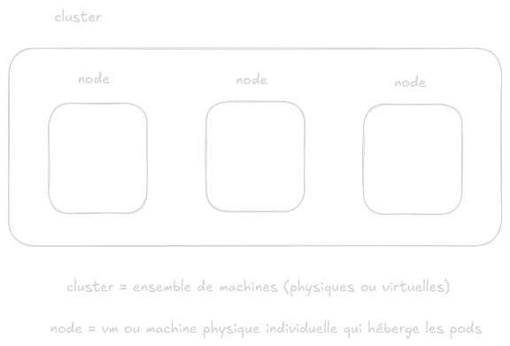
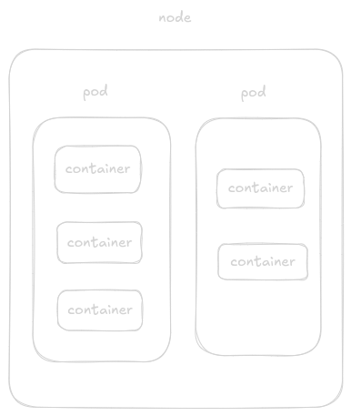
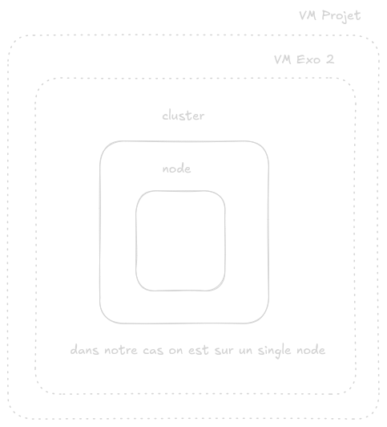
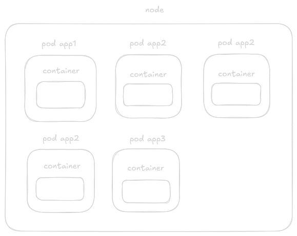
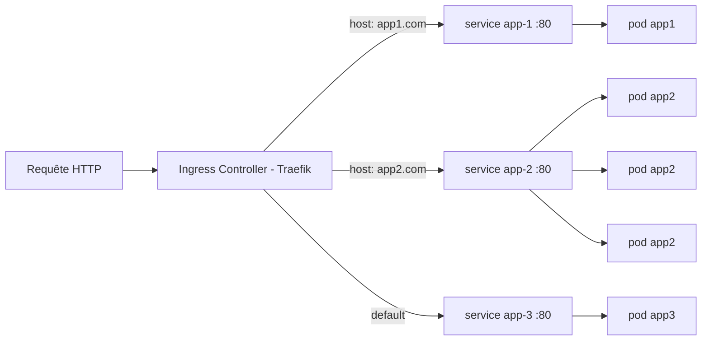
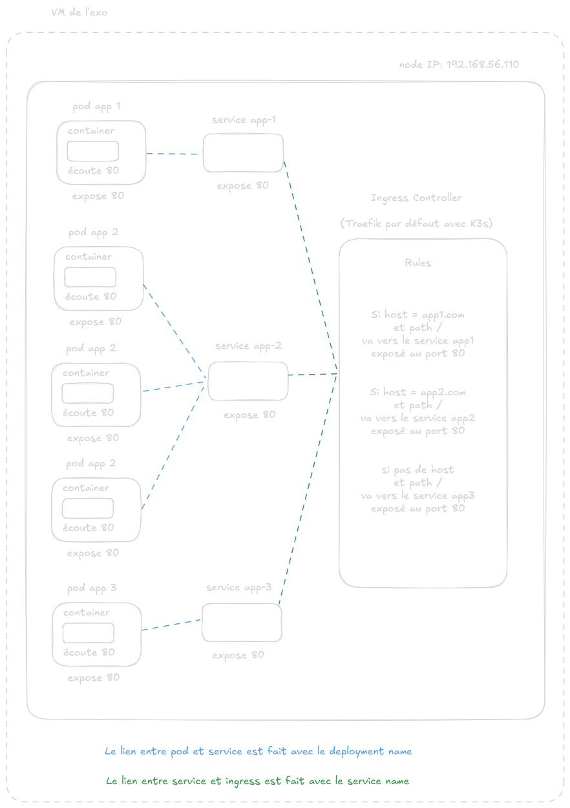
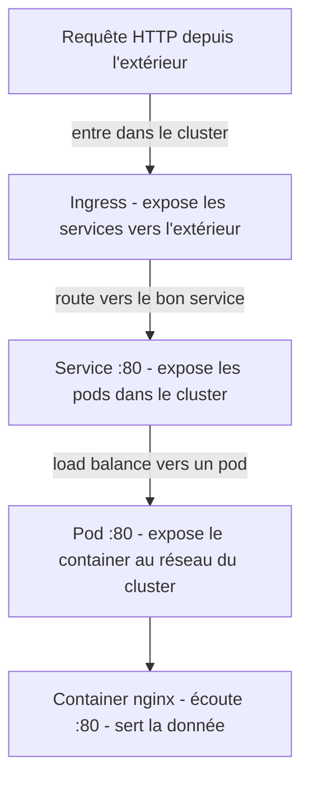
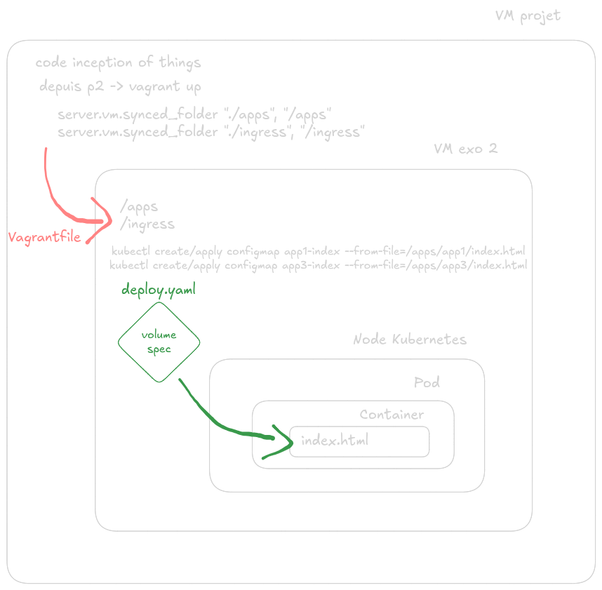
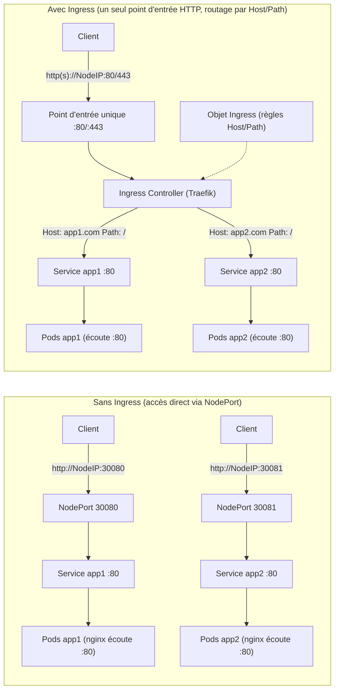

# K3S avec Vagrant Again

Contrairement à l'exercice précédent, on ne crée qu'une seule VM. Tout est géré depuis un seul node qui fait à la fois server (control plane) et agent (workloads). En Kubernetes classique, le master node est protégé par un "taint" qui empêche d'y **scheduler** des pods (c'est-à-dire d'y assigner des workloads à exécuter). K3s n'applique pas cette restriction par défaut, ce qui permet de tout faire tourner sur un seul node sans configuration supplémentaire.

Le but du 2e exo est donc de créer une vm, donc un node dans lequel on lancera 3 apps différentes avec 
- un pod pour app1
- trois pods pour app2
- un pod pour app3

---

## Architecture

<details>
  <summary>Schémas : architecture K3s d'un point de vue général</summary>
  <br>

  <table>
    <tr>
      <td></td>
      <td></td>
    </tr>
  </table>
</details>

<br>

<details>
  <summary>Schémas : architecture infra de l'exo 2</summary>
  <br>

  <table>
    <tr>
      <td></td>
      <td></td>
    </tr>
  </table>
</details>

<br>

<details>
  <summary>Schémas : architecture network de l'exo 2</summary>
  <br>

Flux complet : requête HTTP > Ingress Controller (Traefik) > Service > Pods



  <table>
    <tr>
      <td></td>
    </tr>
  </table>
</details>

<br>

<details>
  <summary>Écouter vs Exposer</summary>
  <br>

Chaque couche **expose** (rend accessible au niveau supérieur) jusqu'au container qui lui **écoute** (reçoit et sert la donnée) :



| Couche | Verbe | Ce qu'elle fait |
|--------|-------|-----------------|
| **Container** | **écoute** | Le processus nginx bind le port 80, reçoit les requêtes et renvoie du HTML |
| **Pod** | **expose** | Rend le port du container accessible au réseau interne du cluster |
| **Service** | **expose** | Fournit une IP stable + DNS + load balancing vers les pods |
| **Ingress** | **expose** | Rend le service accessible depuis l'extérieur du cluster via HTTP |

</details>

---

## Explication du code


<details>
<summary><strong>Vagrantfile</strong></summary>
<br>

<u><strong>Dossier partagé</strong></u>

`synced_folder` monte un volume partagé entre la machine hôte et la VM.
Cela permet de synchroniser des fichiers entre l'hôte et la machine virtuelle sans copie manuelle.

Concrètement :
- les fichiers sont accessibles **des deux côtés**
- toute modification sur l'hôte est immédiatement visible dans la VM

---

<u><strong>Réseau</strong></u>

Les deux lignes `server.vm.network` du Vagrantfile configurent l'interface **eth1** de la VM. eth0 (NAT libvirt, accès internet) est créée automatiquement et n'apparaît pas dans le Vagrantfile.

**private_network** -- crée eth1 avec une IP fixe :

```ruby
server.vm.network :private_network, ip: "192.168.56.110"
```

- Crée l'interface eth1 sur le réseau privé `192.168.56.0/24`
- Attribue l'IP fixe `192.168.56.110` à la VM
- La VM est accessible depuis l'hôte via cette IP (ex. `curl http://192.168.56.110`)
- Non accessible depuis l'extérieur

**forwarded_port** -- mappe un port de l'hôte vers la VM :

```ruby
server.vm.network :forwarded_port, guest: 22, host: "8082", id: "ssh"
```

- Redirige le port 8082 de l'hôte vers le port 22 de la VM
- Permet de se connecter en SSH à la VM depuis l'hôte via :
  ```bash
  ssh -p 8082 vagrant@localhost
  ```

**Quelle est la différence ?**

`private_network` donne une **IP fixe** à la VM sur un réseau privé. On accède à la VM directement par son IP. `forwarded_port` ne crée pas d'IP, il **redirige un port** de l'hôte vers la VM. C'est utile quand on veut accéder à un service précis (ici SSH) sans connaître l'IP de la VM.

**Note sur la syntaxe Ruby :**

Les deux types réseau utilisent la notation **symbole** (`:private_network`, `:forwarded_port`). En Ruby, un symbole (préfixé par `:`) est un identifiant léger et immuable. Vagrant accepte aussi la forme string (`"forwarded_port"`), les deux sont interchangeables.
</details>

<details>
<summary><strong>Server.sh</strong></summary>
<br>
  Lorsque la VM démarre, le script **server.sh** est automatiquement exécuté.

- Installation de k3s avec :
```ruby
curl -sfL https://get.k3s.io | sh -
```

- Le script attend que l'API server k3s soit prête (`kubectl get nodes`) avant de lancer les déploiements, car Kubernetes démarre lentement.
- La copie manuelle du kubeconfig vers `/root/.kube/config` n'est pas nécessaire : k3s fournit son propre `kubectl` qui utilise automatiquement `/etc/rancher/k3s/k3s.yaml`.
</details>

<details>
<summary><strong>ConfigMap</strong></summary>
<br>

Une ConfigMap est un objet Kubernetes qui stocke des **paires clé/valeur**. Quand on utilise `--from-file`, la clé est le nom du fichier et la valeur est son contenu. En l'occurrence, on s'en sert pour stocker les fichiers `index.html` de app1 et app3.

**Pourquoi ce pattern ?**

```bash
kubectl create configmap app1-index --from-file=/apps/app1/index.html --save-config -o yaml --dry-run=client | kubectl apply -f -
```

- `create` seul échoue si la ConfigMap existe déjà
- `apply` seul nécessite un fichier YAML

Le pattern combine les deux : `create --dry-run=client` génère le YAML sans rien créer, puis `apply` l'applique (création ou mise à jour).

| Flag | Rôle |
|------|------|
| `--dry-run=client` | Ne crée rien, génère la ressource en mémoire |
| `-o yaml` | Sort la ConfigMap au format YAML |
| `--save-config` | Permet à `apply` de gérer les diffs lors des mises à jour |

**Comment la ConfigMap arrive dans le container ?**

Le `deploy.yaml` déclare un **volume** alimenté par la ConfigMap, et un **volumeMount** qui le monte dans le container au chemin `/usr/share/nginx/html`. Ainsi, nginx sert le fichier `index.html` de la ConfigMap au lieu de sa page par défaut.

<table>
  <tr>
    <td></td>
  </tr>
</table>

</details>

<details>
<summary><strong>Deployment</strong></summary>
<br>

Un Deployment est un objet Kubernetes qui gère le cycle de vie d'un ensemble de pods identiques. Il garantit qu'il y a toujours le bon nombre de replicas en cours d'exécution.

Le fichier `deploy.yaml` contient les champs suivants :

- **`replicas`** : le nombre de pods souhaités (ex. 1 pour app1, 3 pour app2)
- **`selector.matchLabels`** : le label qui identifie les pods gérés par ce Deployment
- **`template`** : le modèle de pod. Chaque replica est un pod créé à partir de ce template
- **`template.metadata.labels`** : les labels du pod. Ils doivent **matcher** le `selector` du Deployment et celui du Service
- **`containers`** : la liste des containers dans le pod (ici un seul : nginx sur le port 80)
- **`volumeMounts`** : le point de montage dans le container (ex. `/usr/share/nginx/html`)
- **`volumes`** : la source du volume, alimentée par la ConfigMap

En résumé : le Deployment crée les pods, la ConfigMap fournit le contenu (index.html), et le volume fait le lien entre les deux.

</details>

<details>
<summary><strong>Service</strong></summary>
<br>

Un Service fournit une **adresse IP stable** et un **nom DNS interne** pour accéder aux pods. Les pods ayant des IP éphémères, le Service abstrait le réseau et assure le **load balancing** quand il y a plusieurs replicas (ex. app2 avec 3 pods).

Le **selector** du Service doit matcher les labels du Deployment pour cibler les bons pods. C'est le lien entre les deux objets.

**Définition des ports :**

| Champ | Rôle | Exemple |
|-------|------|---------|
| `port` | Port exposé par le Service dans le cluster | 80 |
| `targetPort` | Port sur lequel le container écoute | 80 |
| `nodePort` | Port exposé sur le node pour l'accès externe | 30080 |

Dans cet exercice, les trois services sont en **`type: NodePort`**, ce qui les rend accessibles depuis l'extérieur via `<NodeIP>:<nodePort>` (ex. `192.168.56.110:30080` pour app1). L'alternative `type: ClusterIP` ne rend le service accessible que depuis l'intérieur du cluster.

</details>


<details>
<summary><strong>Ingress</strong></summary>
<br>

Un Ingress est une ressource Kubernetes qui décrit des **règles HTTP** (host et path) pour router des requêtes vers des **Services**.

Un Ingress ne fonctionne pas seul : il a besoin d’un **Ingress Controller** (Traefik, Nginx, …) qui reçoit les requêtes HTTP et applique les règles. Sur k3s, **Traefik** est installé par défaut.

### Ce que l’Ingress apporte par rapport à un Service

Un **Service** (NodePort) expose *un* service sur *un* port du node. Sans Ingress, l’accès aux apps se fait typiquement par des ports différents :

```
http://192.168.56.110:30080   → app1
http://192.168.56.110:30081   → app2
http://192.168.56.110:30082   → app3
```

Un **Ingress** permet un **point d’entrée unique** (80/443) et du **routage HTTP** (par host / path) vers plusieurs services :

```
http://app1.com               → app1
http://app2.com               → app2
http://192.168.56.110         → app3 (règle “default”)
```

### Schéma visuel (Service vs Ingress)



### Lecture rapide de `ingress/ingress.yaml`

- Chaque bloc `rules` route un **host** et un **path** vers un Service :
  - `spec.rules[].host` : nom de domaine (ex. `app1.com`)
  - `paths[].path` + `pathType: Prefix` : toutes les requêtes qui commencent par ce chemin matchent la règle
  - `backend.service.name` : **nom du Service** cible (ex. `app1-service`)
  - `backend.service.port.number` : **port du Service** (ici `80`)

Le Service relaie ensuite vers les pods via `targetPort` (défini dans le Service) qui correspond au port sur lequel le container écoute.
</details>

---

## Les CLI utiles

- la cli pour avoir le recap des objets kubernetes
```ruby
kubectl get all
```

- la cli pour aller dans le container
```ruby
kubectl exec -it <pod-name> -- /bin/sh
```
(Si message d'erreur, c'est que la box de la vm n'est pas assez puissante)

- la cli pour avoir les infos services du namespace kube-system (utile pour Traefik)
```ruby
kubectl get svc -n kube-system
```

**Les checks (Ingress / Services) :**

- Depuis la VM de l'exo (sur le node, vers Traefik en local) :

```bash
curl http://localhost
curl -H "Host: app1.com" http://localhost
curl -H "Host: app2.com" http://localhost
```

- Depuis la VM projet (accès externe vers le node) :

```bash
curl http://192.168.56.110
curl -H "Host: app1.com" http://192.168.56.110
curl -H "Host: app2.com" http://192.168.56.110
```

- Check direct via NodePort (sans Ingress) :

```text
http://192.168.56.110:30081  (NodePort de app2)
```

---

## Pourquoi KVM et pas VirtualBox ?

En **nested virtualization** (VM mère → VM Vagrant), on a deux niveaux d'hyperviseurs. Le choix du provider change beaucoup les perfs :

```
┌─────────────────────────────────────────────────────────────────┐
│  Hôte physique (nested VT-x activé)                              │
│  ┌───────────────────────────────────────────────────────────┐   │
│  │  VM mère (ex. Ubuntu)                                      │   │
│  │  ┌─────────────────────┐   ┌─────────────────────────────┐ │   │
│  │  │ VirtualBox (type 2)  │   │ KVM (dans le noyau Linux)   │ │   │
│  │  │ → 2e couche lourde  │   │ → 1 seule couche, léger     │ │   │
│  │  │ → souvent lent      │   │ → nested KVM bien supporté  │ │   │
│  │  └─────────────────────┘   └─────────────────────────────┘ │   │
│  │           ❌ lent                        ✅ préféré          │   │
│  └───────────────────────────────────────────────────────────┘   │
└─────────────────────────────────────────────────────────────────┘
```

- **VirtualBox** = hyperviseur de type 2 (logiciel complet) → double couche en nested = souvent très lent.
- **KVM** = intégré au noyau, conçu pour la virtualisation, nested KVM documenté et performant → on privilégie libvirt/KVM.

---

## Vagrant, libvirt, QEMU, KVM : qui fait quoi ?

```
┌───────────────────────────────────────────────┐
│  Vagrant                                       │
│  → Orchestrateur CLI                           │
│  → Gère le cycle de vie de la VM               │
│    (create, up, ssh, destroy, provision...)     │
│                                                │
│  ┌───────────────────────────────────────────┐ │
│  │  vagrant-libvirt (plugin)                  │ │
│  │  → Fait le lien entre Vagrant et libvirt   │ │
│  │                                            │ │
│  │  ┌───────────────────────────────────────┐ │ │
│  │  │  libvirt                               │ │ │
│  │  │  → API / couche d'abstraction          │ │ │
│  │  │  → Pilote les hyperviseurs (KVM, etc.) │ │ │
│  │  │                                        │ │ │
│  │  │  ┌──────────────────────────────────┐  │ │ │
│  │  │  │  QEMU + KVM                      │  │ │ │
│  │  │  │  → QEMU = émulateur matériel     │  │ │ │
│  │  │  │  → KVM  = module noyau Linux     │  │ │ │
│  │  │  │    (accélération hardware)        │  │ │ │
│  │  │  └──────────────────────────────────┘  │ │ │
│  │  └───────────────────────────────────────┘ │ │
│  └───────────────────────────────────────────┘ │
└───────────────────────────────────────────────┘
```

| Composant | Rôle | Analogie |
|-----------|------|----------|
| **KVM** | Module du **noyau Linux**. Il transforme Linux en hyperviseur en utilisant les instructions CPU (VT-x). C'est lui qui fait tourner la VM à quasi-vitesse native. | Le moteur |
| **QEMU** | **Émulateur matériel**. Il simule le hardware (carte réseau, disque, écran...) pour la VM. Sans KVM, QEMU émule tout (lent). Avec KVM, QEMU délègue le CPU au noyau et ne gère que le reste. | Le châssis |
| **libvirt** | **API / daemon** (`libvirtd`). Couche d'abstraction qui pilote QEMU/KVM via une interface unifiée. `virsh`, `virt-manager` et le plugin Vagrant l'utilisent. | Le tableau de bord |
| **Vagrant** | **Orchestrateur CLI**. Il ne virtualise rien lui-même. Il appelle un **provider** (VirtualBox, libvirt, Docker...) pour créer/gérer les VMs. Il gère aussi le provisioning (scripts), le réseau, les synced folders, SSH, etc. | Le pilote automatique |

---

## Setup (KVM / libvirt)

Prérequis sur la machine qui lance Vagrant (Ubuntu/Debian) :

```bash
sudo apt-get update
sudo apt-get install -y libvirt-dev libvirt-daemon-system qemu-kvm
vagrant plugin install vagrant-libvirt
```

Optionnel : ajouter son utilisateur au groupe `libvirt` puis se reconnecter (ou `newgrp libvirt`) :

```bash
sudo usermod -aG libvirt $USER
```

Récupérer la box (une fois) puis lancer la VM :

```bash
cd p2
vagrant box add generic/debian12 --provider libvirt   # une seule fois
vagrant up --provider=libvirt
```

**Faut-il préciser le provider à chaque fois ?**  
Oui, sauf si tu fixes le provider par défaut. Pour ne plus avoir à mettre `--provider=libvirt` :

```bash
export VAGRANT_DEFAULT_PROVIDER=libvirt
vagrant up
```

Tu peux ajouter `export VAGRANT_DEFAULT_PROVIDER=libvirt` dans ton `~/.bashrc` si tu restes toujours sur libvirt pour ce projet.