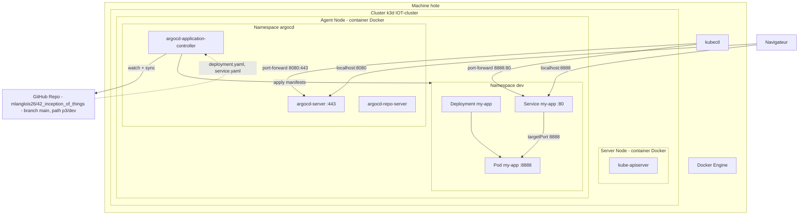
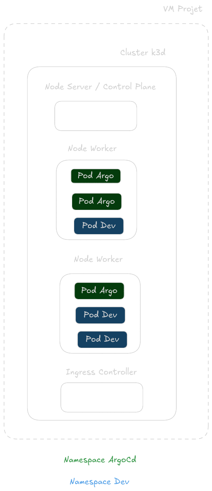
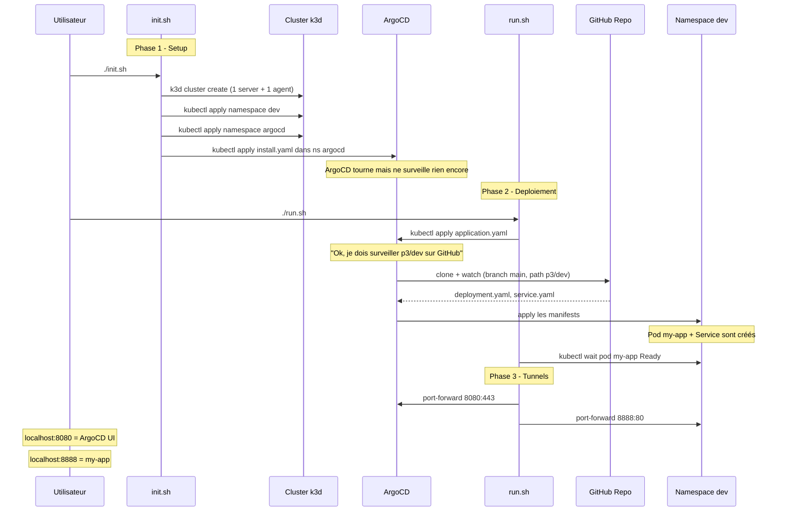

# KD3 et ArgoCD

---

Le but de l'exo est d'utiliser :

- **k3d** : un moyen de lancer un cluster Kubernetes local dans des conteneurs Docker. Le kube-apiserver et les nodes tournent dans des containers Docker.
- **ArgoCD** : un GitOps controller pour Kubernetes.

L'installation d'ArgoCD déploie plusieurs pods dans le cluster k3d dont :
 - argocd-server (UI/API)
 - argocd-repo-server
 - argocd-application-controller

### Architecture



---

### Prérequis : Docker & kubectl

k3d fait tourner les nœuds Kubernetes dans des conteneurs Docker, et `kubectl` est nécessaire pour interagir avec le cluster. Il faut donc les installer sur la machine hôte avant de lancer `init.sh`.

<details>
  <summary>Installer Docker</summary>
  <br>

  ```bash
  sudo apt-get update
  sudo apt-get install -y docker.io
  ```

  Démarrer le daemon et l'activer au boot :
  ```bash
  sudo systemctl start docker
  sudo systemctl enable docker
  ```

  Ajouter ton utilisateur au groupe `docker` (pour ne pas avoir besoin de `sudo` à chaque commande) :
  ```bash
  sudo usermod -aG docker $USER
  ```
  Puis **se déconnecter / reconnecter** (ou `newgrp docker`) pour que le changement prenne effet.

  Vérifier que Docker tourne :
  ```bash
  docker ps
  ```
</details>

<details>
  <summary>Installer kubectl</summary>
  <br>

  `kubectl` est le CLI pour piloter un cluster Kubernetes. k3d crée le cluster et configure le kubeconfig, mais il ne fournit pas `kubectl`.

  ```bash
  sudo snap install kubectl --classic
  ```

  Vérifier l'installation :
  ```bash
  kubectl version --client
  ```
</details>

---

### Init.sh

<details>
  <summary>Installation de K3d</summary>
  <br>

  Vérifier si l'exécutable k3d est présent avec 
  ```bash
  command -v k3d
  ```
  Rediriger stdout et stderr /dev/null pour ne rien afficher
  ```bash
  &> /dev/null
  ```
  Télécharger et installer k3d via le script officiel (-s pour silent mode pour moins de message)
  ```bash
  curl -s https://raw.githubusercontent.com/k3d-io/k3d/main/install.sh | bash
  ```
  Si le cluster existe déjà, on le supprime :
  ```bash
  k3d cluster list | grep -q "$CLUSTER_NAME" && k3d cluster delete $CLUSTER_NAME
  ```
  Puis on le crée avec un node server et un node agent.
  `--wait` bloque la commande et attend que le cluster soit prêt avant de lancer les objets Kubernetes :
  ```bash
  k3d cluster create $CLUSTER_NAME --servers 1 --agents 1 --wait
  ```
</details>

<details>
  <summary>Les Namespaces</summary>
  <br>

  - Un namespace, c'est une isolation logique pour organiser les ressources
  - Un namespace peut avoir ses pods sur plusieurs nodes, et plusieurs namespaces peuvent partager les mêmes nodes (c'est Kubernetes qui gère l'ordonnancement)

  💡 Bonnes pratiques :

  - Namespaces → utiliser pour organiser, isoler, gérer les droits d’accès et quotas
  - Nodes → dimensionner selon le nombre de pods, la charge, la résilience
  - Ne pas créer un node pour chaque namespace → ça devient inutile et compliqué à gérer

  <table>
    <tr>
      <td></td>
    </tr>
  </table>

  Dans `init.sh`, on crée deux namespaces via leurs fichiers YAML :
  ```bash
  kubectl apply -f dev/namespace.yaml      # namespace "dev" pour l'application
  kubectl apply -f argocd/namespace.yaml   # namespace "argocd" pour Argo CD
  ```

</details>

<details>
  <summary>ArgoCD</summary>
  <br>

 - <u>C'est quoi ?</u>

    - Argo CD est un outil GitOps pour Kubernetes.
    - GitOps : méthode pour gérer ton cluster Kubernetes à partir de Git
    - Ton dépôt Git devient la “source de vérité” pour l’état désiré de tes applications
    - Kubernetes n’a qu’à appliquer ce qui est défini dans Git
    - Argo CD observe ton Git et fait en sorte que ton cluster corresponde toujours à ce que tu as défini dans Git.
    - Si un pod est supprimé manuellement → Argo CD peut le recréer automatiquement
    - Si tu modifies un manifeste dans Git → Argo CD met à jour ton cluster
    <br>
    💡 Donc en gros, Kubernetes obéit à Git. Plus besoin de `kubectl apply` les `deployments`, les `services` et les `ingress` à la main

<br>

- <u>C'est quoi la diff avec une Github Action ?</u>

    - Avec la GitHubAction, il faudrait décrire la step. On aurait toujours le .yaml avec notre `kubectl apply`

| Aspect              | CI/CD classique                  | GitOps / Argo CD                                 |
| ------------------- | -------------------------------- | ------------------------------------------------ |
| Déploiement         | `kubectl apply` dans un workflow | Argo CD lit Git et applique tout automatiquement |
| Surveillance        | Aucune                           | Argo CD monitor le cluster et Git                |
| Gestion des dérives | Manuelle                         | Auto-heal / reconcile                            |
| Workflow Git        | “push → CI → apply → cluster”    | “push → Argo CD synchronise → cluster”           |
| Qui applique        | Runner GitHub Actions            | Argo CD (controller dans le cluster)             |


<br>

- <u>Installation dans init.sh</u>

  On installe ArgoCD via le manifest officiel avec `--server-side=true` (nécessaire car certaines CRDs dépassent la taille max d'annotation côté client) :
  ```bash
  kubectl apply -n argocd --server-side=true -f https://raw.githubusercontent.com/argoproj/argo-cd/stable/manifests/install.yaml
  ```

  Cette seule commande crée tout ce qu'il faut dans le namespace `argocd` :

  ```mermaid
  graph TB
      subgraph install ["Ce que install.yaml cree dans le namespace argocd"]
          direction TB
          CRDs["CRDs : Application, AppProject..."]
          subgraph pods ["Deployments / Pods"]
              argoServer["argocd-server - UI + API :443"]
              argoRepo["argocd-repo-server - clone les repos Git"]
              argoController["argocd-application-controller - boucle watch + sync"]
          end
          subgraph infra ["Services, RBAC, Config"]
              svc["Services : expose les pods en interne"]
              sa["ServiceAccounts + ClusterRoles - droits pour apply dans tous les ns"]
              cm["ConfigMaps + Secrets - config ArgoCD + mdp admin"]
          end
      end
      CRDs -.->|"permet de creer des objets Application"| argoController
      argoController -->|"demande les repos"| argoRepo
      argoController -->|"applique les manifests via API K8s"| target["Namespace cible"]
  ```

  - Les **CRDs** apprennent à Kubernetes ce qu'est un objet `Application`. Sans elles, `kubectl apply -f application.yaml` échouerait.
  - Le **argocd-application-controller** est une boucle infinie : il watch les objets `Application`, demande à **argocd-repo-server** de cloner le repo, puis applique les manifests via l'API Kubernetes.
  - Les **RBAC** donnent au controller les droits d'apply dans n'importe quel namespace (c'est pour ça qu'il peut créer des ressources dans `dev`).

  > 💡 Le comportement "auto-heal" (recréer un pod supprimé manuellement, corriger une dérive) n'est pas activé par défaut dans ArgoCD.
  > C'est le `syncPolicy.automated` avec `selfHeal: true` et `prune: true` dans l'`Application.yaml` qui l'active.

<br>

- <u>Accéder à l'UI ArgoCD</u>

  Attends que le pod UI (argocd-server) soit prêt avec :
  ```bash
  kubectl wait --for=condition=Ready pod -l app.kubernetes.io/name=argocd-server -n argocd --timeout=120s
  ```
  
  Ouvre un tunnel depuis la vm vers ArgoCD
  ```bash
  kubectl port-forward svc/argocd-server -n argocd 8080:443
  ```
  L'UI sera sur ***http://localhost:8080***


  Pour s'y connecter, ArgoCD crée automatiquement un mot de passe admin initial.
  Il le stocke dans un secret Kubernetes intitulé ***argocd-initial-admin-secret***, il faut donc le récupérer avec :
  ```bash
  kubectl get secret argocd-initial-admin-secret -n argocd -o jsonpath="{.data.password}" | base64 -d
  ```
  - extrait la valeur du password avec jsonpath
  - décode avec base64 -d
</details>

---

### Le flow complet : init.sh → run.sh



---

### Run.sh

<details>
  <summary>Ce que fait run.sh étape par étape</summary>
  <br>

  **Etape 1 — Appliquer `application.yaml`**

  ```bash
  kubectl apply -f argocd/application.yaml
  ```

  C'est la commande clé. Elle crée un objet `Application` dans ArgoCD (voir section suivante). A partir de là, ArgoCD prend le relais : il va sur GitHub, lit les manifests dans `p3/dev/`, et les applique dans le namespace `dev`.

  **Etape 2 — Attendre que le pod soit prêt**

  ```bash
  kubectl wait --for=condition=Ready pod -l app=my-app -n dev --timeout=120s
  ```

  ArgoCD a besoin de quelques secondes pour cloner le repo, lire les manifests et créer le pod. On attend qu'il soit `Ready` avant d'ouvrir les tunnels.

  **Etape 3 — Ouvrir les tunnels**

  Le cluster k3d tourne dans Docker. Les services Kubernetes ne sont pas directement accessibles depuis la machine hôte. On utilise `kubectl port-forward` pour créer un tunnel :

  ```bash
  kubectl port-forward svc/argocd-server -n argocd 8080:443 &   # ArgoCD UI
  kubectl port-forward svc/my-app -n dev 8888:80 &              # Application
  ```

  | Port local | Service | Port du service | Cible dans le pod | Accès |
  |---|---|---|---|---|
  | 8080 | `svc/argocd-server` (ns argocd) | 443 | argocd-server | http://localhost:8080 |
  | 8888 | `svc/my-app` (ns dev) | 80 → targetPort 8888 | my-app (wil42/playground) | http://localhost:8888 |

  `Ctrl+C` stoppe les deux port-forwards.
</details>

---

### Application.yaml

<details>
  <summary>C'est quoi cet objet ?</summary>
  <br>

  `application.yaml` n'est **pas** un objet Kubernetes natif (contrairement au Deployment, Service, Ingress).
  C'est un **CRD** (Custom Resource Definition) ajouté par ArgoCD quand on l'a installé.

  Il ne crée **aucun pod** directement. Son rôle, c'est de dire à ArgoCD :

  > "Surveille ce repo Git, ce dossier, cette branche. Tout ce que tu trouves dedans, applique-le dans ce namespace."

  ```yaml
  source:
    repoURL: https://github.com/mlanglois26/42_inception_of_things.git
    targetRevision: main       # branche à surveiller
    path: p3/dev               # dossier contenant les manifests
  ```

  ArgoCD va y trouver 2 manifests :
  - `deployment.yaml` → crée le pod `my-app` (image `wil42/playground:v1`)
  - `service.yaml` → expose le pod sur le port 80 (targetPort 8888)

  ```yaml
  destination:
    server: https://kubernetes.default.svc   # le cluster local
    namespace: dev                            # où déployer
  ```

  ```yaml
  syncPolicy:
    automated:
      prune: true       # si un manifest est supprimé de Git → la ressource est supprimée du cluster
      selfHeal: true    # si quelqu'un modifie un pod à la main → ArgoCD le remet comme dans Git
  ```

  💡 C'est grâce à `automated` + `selfHeal` + `prune` qu'ArgoCD fait du vrai GitOps : Git est la source de vérité, le cluster s'aligne en permanence.
</details>